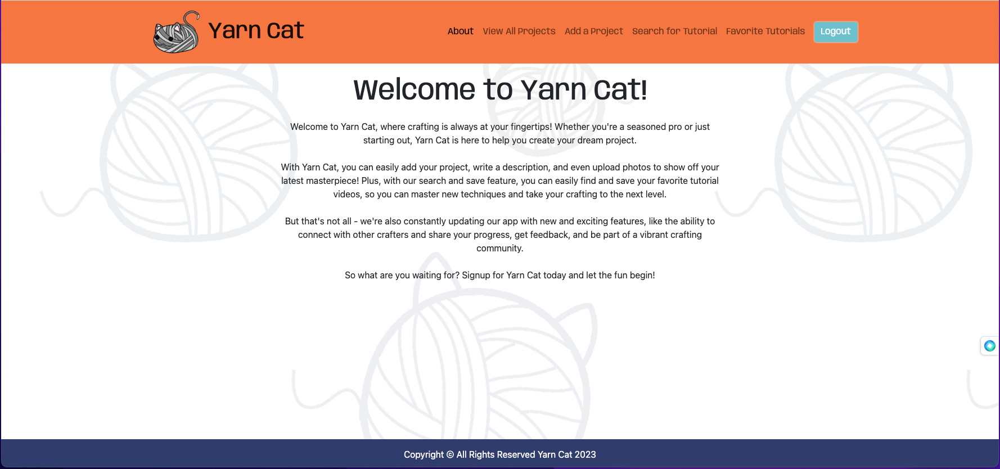
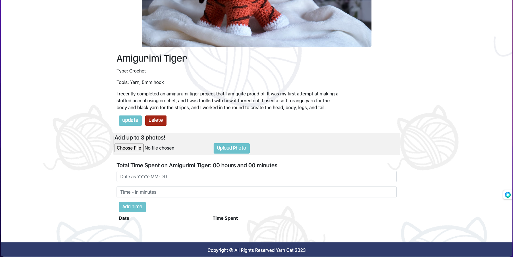
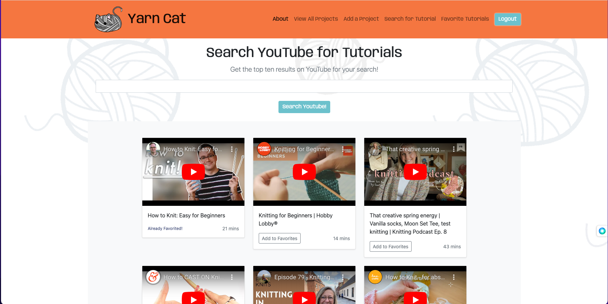

# Yarn Cat!

Yarn Cat is a web app I created using the full-stack Django framework. It allows users to easily upload and manage their crafting projects. With Yarn Cat, users can add project descriptions, upload photos, and track time spent on each project.

Authentication is handled through Django's built-in system, while authorization is implemented to restrict access to specific resources. The app is powered by PostgreSQL, ensuring that data is safely and reliably stored.

Users can search and favorite tutorial videos using the YouTube API to help them learn new techniques and enhance their crafting skills. Yarn Cat is deployed online using Heroku and features professional styling with CSS and Bootstrap.

As the sole creator of Yarn Cat, I'm proud to offer a user-friendly and visually appealing app that helps crafters stay organized and productive.

## Technologies Used  

- HTML5
- CSS3
- JavaScript
- Google Fonts
- Python
- Django
- Youtube API 

## Screenshots

## Getting Started

[Click Here](https://yarncat.herokuapp.com/) to see the deployed app!

## Future Enhancements

- The ability to see other users projects and be able to comment on them

